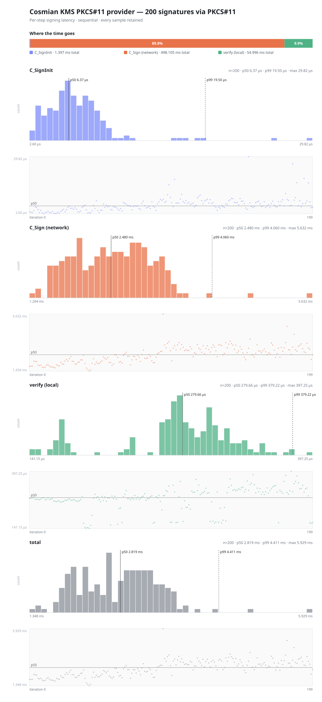

# Summary

`sign-tx` was benchmarked against a real, locally-run Cosmian KMS
(v5.27.1, `hsm_delegation_benchs` branch) over PKCS#11, signing Solana-shaped
transfer transactions with a **ed25519** key created via `ckms`.

**This corrects a previous version of this report.** That version claimed
Ed25519 keys are invisible to Cosmian's PKCS#11 provider (citing
[Cosmian/kms#1183](https://github.com/Cosmian/kms/issues/1183) and a quoted
`key_algorithm_from_attributes` snippet with no `Ed25519`/`Ed448` match
arms), and used NIST P-256 as a workaround. Neither holds up on the
`hsm_delegation_benchs` branch used for this run:

- `crate/clients/pkcs11/provider/src/kms_object.rs::key_algorithm_from_attributes`
  has explicit `CryptographicAlgorithm::Ed25519 => KeyAlgorithm::Ed25519` and
  `Ed448 => KeyAlgorithm::Ed448` arms — not the "falls into the `x => ...`
  branch and is rejected" behavior the issue describes. `git log -S` dates those arms to commit `044b3c83a (2026-09-09)`.
- The single-signature sanity check and the full 100000-iteration
  benchmark below both ran end to end — real key creation via `ckms`, real
  `C_GetInterface`/`C_MessageSignInit`/`C_SignMessage` through the real PKCS#11 v3
  provider, real network round trips to a real KMS server — with zero
  failures.

**Headline result: 249.67 µs median (p50) end-to-end signing latency,
~4005.3 signatures/sec sequential throughput. The KMS network round trip
(`C_SignMessage`) accounts for ~85.8% of total time.**

# Test Configuration

| Parameter          | Value                                              |
|---------------------|-----------------------------------------------------|
| KMS                 | Cosmian KMS 5.27.1 (non-FIPS, speed-oriented bench profile), SQLite backend |
| Transport           | `libcosmian_pkcs11.so` (Cosmian KMS PKCS#11 provider 5.27 (Cryptoki 3.1)) |
| PKCS#11 interface   | v3, discovered through `C_GetInterface`; Ed25519 uses `C_MessageSignInit` once and `C_SignMessage` per iteration |
| KMS wire protocol   | TTLV-BYTES over `POST /kmip` (`application/octet-stream`) |
| Curve / mechanism   | ed25519, `CKM_EDDSA (Ed25519, pure)` |
| Key provisioning    | `ckms ec keys create --curve ed25519 --tag disk-encryption bench-ed25519-key` |
| Public key handling | `ckms ec keys export --key-format pkcs8-der`, supplied via `--public-key` (the provider does not implement `CKA_EC_POINT` for either curve) |
| Payload             | Solana transfer message, 150 bytes |
| Iterations          | 100000 measured |
| Warmup              | minimum 50 iterations and 3 seconds per trial |
| Independent trials  | 3; median trial by total p50 selected |
| CPU affinity        | sign-tx: unrestricted; KMS: unrestricted |
| Concurrency         | 1 (sequential — latency, not throughput under load) |
| Environment         | Local processes, no Docker/containers: `cosmian_kms` server + `ckms` + `sign-tx` all on `manu-Intel-Office-Mini-Ii`, connected over `127.0.0.1` |

# Results

| Phase              | n    | min       | p50       | p90       | p99       | p999      | max       | stddev    |
|--------------------|------|-----------|-----------|-----------|-----------|-----------|-----------|-----------|
| `C_SignMessage` (network) | 100000 | 125.19 µs | 217.56 µs | 383.94 µs | 546.39 µs | 695.66 µs | 1.133 ms | 98.90 µs |
| verify (local)     | 100000 | 27.31 µs | 32.59 µs | 73.75 µs | 119.19 µs | 126.69 µs | 266.84 µs | 21.07 µs |
| **total**          | 100000 | 153.65 µs | 249.67 µs | 446.80 µs | 645.04 µs | 775.18 µs | 1.237 ms | 113.86 µs |

- **Throughput:** 4005.3 sig/s at p50, 3536.7 sig/s at mean
- **`C_SignMessage` share:** 85.8% of total time (the network-bound component)
- **Wall clock:** 28.290 s for 100000 iterations
- **Warmup (discarded):** n=10757 first=1.869 ms p50=243.04 µs last-min=156.78 µs
- **Failures:** 0 — every iteration signed and locally verified successfully

# Run Stability

Each trial used a fresh warmup and the same already-provisioned key/session
configuration. The median trial by total p50 is used for the detailed phase table
and chart above; all raw trial CSV files are retained.

| Trial | Total p50 |
|---:|---:|
| 1 | 249.67 µs **(representative)** |
| 2 | 225.25 µs |
| 3 | 250.77 µs |

# Chart

# Notes and Caveats

- **KMS transport.** The PKCS#11 provider wraps the KMIP Sign operation in a
  KMIP 2.1 `RequestMessage`, serializes it as binary TTLV, sends it to the
  `/kmip` octet-stream endpoint, and fully parses the binary TTLV response.
- **Signing input.** `CKM_EDDSA` (pure Ed25519) signs the raw message directly — no client-side hash step before `C_Sign`.
- **Signature size.** Ed25519 signatures are a constant 64 bytes, so `sign-tx` presizes the output buffer and skips the length-query `C_Sign` call entirely for this curve — one round trip per signature.
- **Solana address shape.** A Solana account address is a 32-byte Ed25519 public key — exactly what this key produces, so the "from" field in this run is a genuinely Solana-shaped address (unlike a P-256 run, where a 65-byte SEC1 point must be truncated/padded to fit). The transaction is still never broadcast (a placeholder `recent_blockhash` is used), so this does not make it a *valid* transaction — only a correctly-*shaped* one.
- **Latency, not throughput under load.** Signing is sequential, one session,
  one thread — these percentiles describe per-signature latency, not what a
  concurrent/pipelined client would observe under load.
- **Host caveat.** Run on a shared, non-dedicated development machine (not a
  benchmarking-grade isolated host); absolute numbers may vary run to run.

# Raw Data

Raw per-iteration samples: `samples.csv` (100000 rows, columns:
`iteration`, `sign_init_ns`, `sign_ns`, `verify_ns`, `total_ns`). The
public key (`public_key.der`, DER SubjectPublicKeyInfo) used for this run is
also included. `samples-run-N.csv` contains each independent trial.

Generated by `bench.sh` on 2026-09-11.
